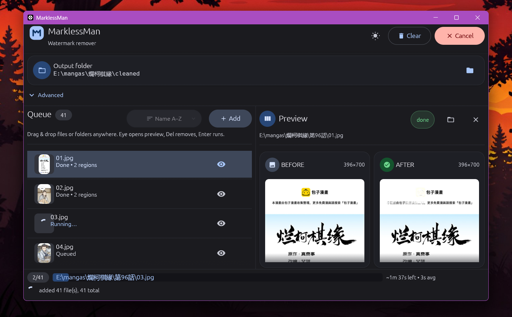

# MarklessMan

> (water)mark-less-man(hwa/hua/ga)

Removes watermarks from manhwa, manhua and manga pages: scanlator banners, site URLs and corner logos.

A detector finds the watermark, a cleaner model repaints the area underneath, and the patch is blended
back in with a soft edge to hide the seam. Everything runs locally on ONNX Runtime. Currently, the only supported accelerator is DirectML on
Windows, and the CPU path is good enough without it.



MarklessMan works on semi-transparent (alpha-blended) watermarks. Opaque watermarks that fully cover the art are not supported.


Pixels outside the detected boxes are copied from the original unchanged.

## Repo layout

| Folder | Contents |
| --- | --- |
| `marklessman-core` | The library: `Detector`, `Cleaner`, `Pipeline`, and options for choosing a backend. |
| `marklessman-gui` | Desktop app. Drop in pages, watch them process, switch between CPU and DirectML, and download models. |
| `marklessman-lab` | Experimental command-line tool (`mm-lab`) used to develop the pipeline. |
| `notebooks` | Kaggle notebooks that train both models and export them to ONNX. |
| `scripts` | Python scripts for building datasets and checking results against the Rust code. |

## Installing

### Recommended

Download the app from the [releases page](https://github.com/OWNER/REPO/releases). This is the supported way to use MarklessMan.

### From source

Building from source requires Rust. DirectML on Windows needs a DirectX 12 GPU, but the CPU path works
without one.

```bash
# Desktop app
cargo run --release -p marklessman-gui

# Run the full pipeline on one file
cargo run --release -p marklessman-core --example full_pipeline -- page.jpg page_clean.jpg

# Tests
cargo test
```

`marklessman-lab` is a development tool for the pipeline. It processes a single file or a whole folder:

```bash
cargo run --release -p marklessman-lab -- \
  --model weights/marklessman-cleanv1_256_fp32.onnx \
  --det-model weights/marklessman-detv1.onnx \
  --input in/ --output out/ --mode full
```

Other flags: `--pad`, `--stride`, `--tile-feather`, `--conf`, `--iou`, `--intra-threads`,
`--clean-dml`, `--deterministic`, `--opt-level`, `--bench-clean` and `--profile`.

## Using the library

```rust
use marklessman_core::{Cleaner, Detector, Pipeline, SessionOptions};

let backend = SessionOptions::directml();          // or SessionOptions::cpu()
let detector = Detector::open("weights/marklessman-detv1.onnx", &backend)?;
let cleaner = Cleaner::open("weights/marklessman-cleanv1_256_fp32.onnx", &backend)?;
let mut pipeline = Pipeline::new(detector, cleaner);

let source = image::open("page.jpg")?.to_rgb8();
let processed = pipeline.process(&source)?;
processed.image.save("page_clean.jpg")?;
```

## How the pipeline works

- Each detection box is expanded by 64 px so the model sees the watermark along with its surroundings.
- Regions larger than 256 px are repainted in tiles with a 192 px step (64 px overlap), then the tile
  edges are blended. Regions of 257 to 380 px are resized to a single square, since tiling at
  that size leaves visible seams.
- Tiles are prepared in parallel and sent to the model in batches of 8.
- If the GPU can't run part of the model, that part falls back to the CPU.

## Models

The app downloads the models it needs on first launch.

| Model | What it does | File | Source |
| --- | --- | --- | --- |
| Detector | YOLO-based model that finds watermarks and returns bounding boxes. | `marklessman-detv1.onnx` | https://huggingface.co/Liiesl/marklessman-detv1 |
| Cleaner | SLBR-based blind removal model for visible watermarks. | `marklessman-cleanv1_256_fp32.onnx` | https://huggingface.co/Liiesl/marklessman-cleanv1 |

The cleaner currently works on see-through (semi-transparent) watermarks only. Opaque watermarks that fully cover the art are not supported.

Models are saved to `%APPDATA%\marklessman\models` on Windows and `~/.config/marklessman/models` on
Linux and macOS. To use your own model file, point to it in the Advanced panel.

## Training

Training runs on Kaggle. Paste each notebook into a Kaggle notebook and run it from top to bottom.

| Step | Notebook | What it does |
| --- | --- | --- |
| Dataset | `notebooks/kaggle_gen.py`, `scripts/generate_datasets.py` | Builds two datasets from the same pages: one for the detector (1 to 3 watermarks pasted onto a clean page) and one for the cleaner (256 px tiles in the layout it expects). Half the watermarks come from a generated bank (`scripts/synthetic_wm.py`) and half are real. |
| Detector | `notebooks/kaggle_train_yolo.py` | Trains YOLO26s for 100 epochs at 640 px. |
| Cleaner | `notebooks/kaggle_train_slbr.py` | Finetunes SLBR from a pretrained checkpoint. Set `MOCK_RUN = True` for a 30-second test run first. |
| Export | `notebooks/kaggle_export_onnx.py`, `notebooks/kaggle_export_slbr_onnx.py` | Converts the trained weights to ONNX and verifies that the output matches. |

## Limitations

- Only see-through watermarks are supported. Opaque watermarks are not.
- Invisible watermarks embedded in the image data are not handled.

## Citation

The cleaner is based on [SLBR](https://github.com/bcmi/SLBR-Visible-Watermark-Removal). If you find this work or code helpful in your research, please cite the SLBR paper:

```bibtex
@inproceedings{liang2021visible,
  title={Visible Watermark Removal via Self-calibrated Localization and Background Refinement},
  author={Liang, Jing and Niu, Li and Guo, Fengjun and Long, Teng and Zhang, Liqing},
  booktitle={Proceedings of the 29th ACM International Conference on Multimedia},
  pages={4426--4434},
  year={2021}
}
```

## License

MarklessMan is released under the [MIT License](LICENSE).